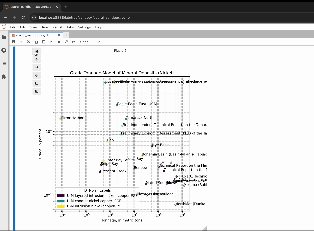

# MinMod `sandbox`

checkout the `sparql_sandbox.ipynb` file to play around with the MinMod Knowledge Graph data available on our [Mineral Data Browser](https://minmod.isi.edu/). 

### Installation
with `pip`:
```
pip install -r requirements.txt
```

### Running 
make sure `jupyter` is installed, then
```
jupter lab
# or
#jupyter notebook
```

### Demo of Grade-Tonnage model generation & results navigation:
#### Executing all cells (or just the relevant ones) can generate this viewer interface
